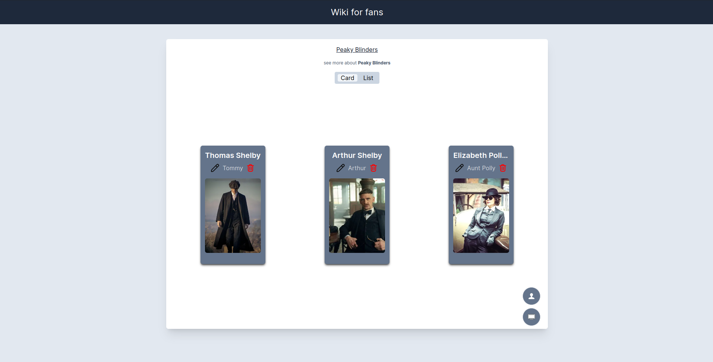
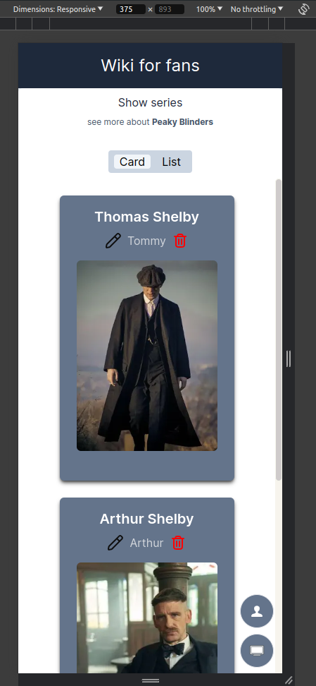
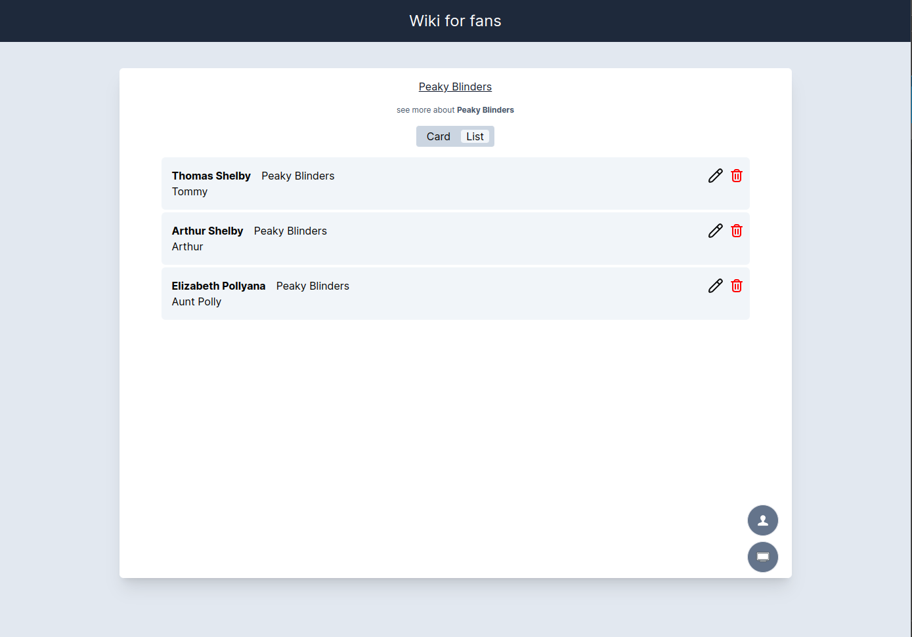
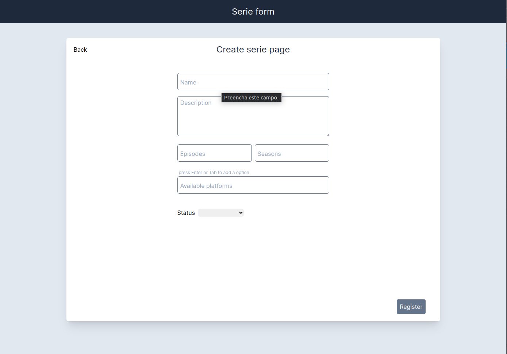
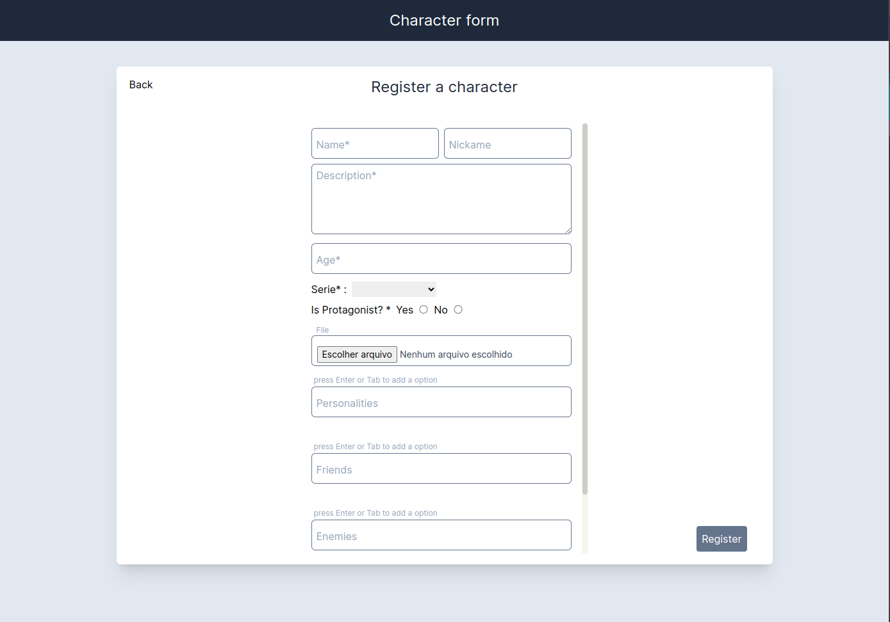

# Wiki For Fans

### This project is a wiki designed for fans, providing a platform where users can explore and contribute information about various topics of interest

[see in production](https://wiki-for-fans.vercel.app/)

## Getting Started

First, run the development server:

**You will need to have docker installed**

setup `environment variables` - cloudinary

```bash
# Install dependencies
yarn
```

```bash
# Run the `compose` file to create the container
npm run compose:up
```

```bash
# synchronize the Prisma schema with database
yarn prisma db push
```

```bash
# Populate the database
yarn prisma db seed
```

```bash
# Run the project
yarn dev
```

Open [http://localhost:3000](http://localhost:3000) with your browser to see the result.

## 📷 Images

- Home:
  
  

- List visualization:
  

- Forms:
  
  
